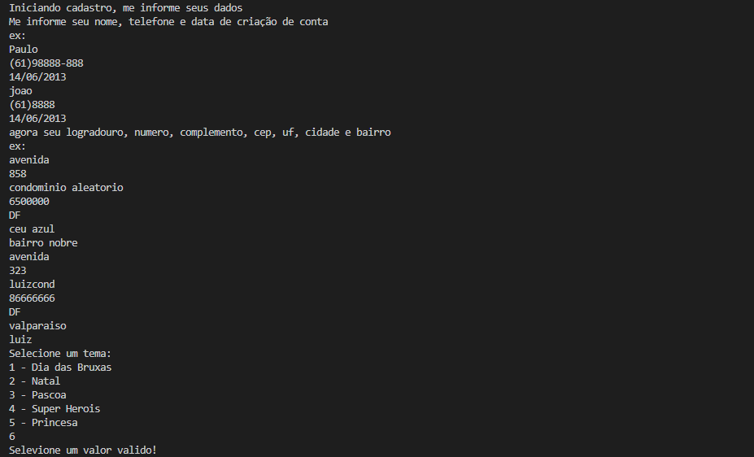
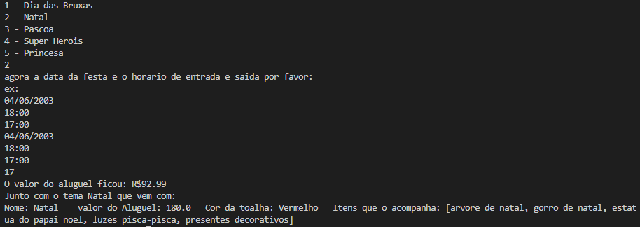

# Aluguel de festa 🎉

- #### Um sistema de vendas, não muito complexo, que executa bem uma venda de um espaço e um tema com base no local, na data e no horario.

- #### Utilizando apenas o basico do Java e organização foi criado um sistema que pode ser utilizado no mercado, basta refinamento e aprimoramento